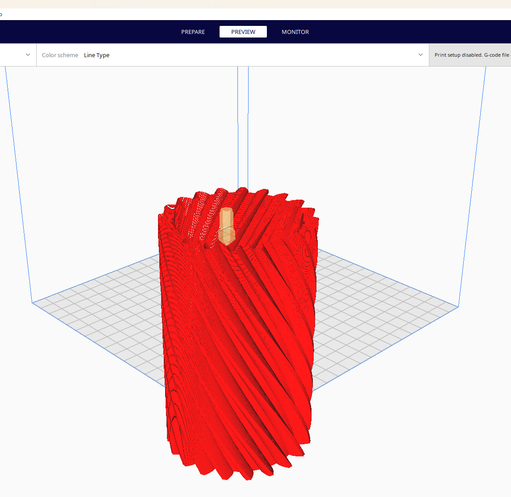

# STL_Slicer
3D nyomtatóhoz, egy egyszerű szeletelő program, ami bármely típúsú .stl kiterjesztésű file-ból .gcode kiterjesztésű "leszeletelt", azaz nyomtatható file-t generál.

A program használatához a mingw32-make parancsal buildelni kell a projektet, a futtatható .exe file a /bin mappában található.

A ./main.exe file futtatása során a paraméterlista formátumát egy példával mutatja be.
Célszerű a /stl_testfiles mappából a teljes élérési utat bemásolni paraméterként, hogy a program biztosan megtalálja a testfile-t.

Az optimális szeletelési vastagság 0.2-0,35 mm között mozog. Persze lehet szésőséges eseteket is kipróbálni, mint az 1 vagy 0.001 mm,
viszont ez esetben a program futási ideje relevánsan megnövekedhet vagy az output file felbontása romlik.

A program futását egy "for" ciklusban az iteráló változó alapján határozza meg a program, hogy éppen hány %-on tart a szeletelés.

A program outputja egy <filename>.gcode kimeneti file, amit szintén a /stl_testfiles mappába helyez a program.

Az output vizualizására a legegyszerűbb megoldás a CURA Slicerrel való megnyitás.
A bintest.gcode outputja:

