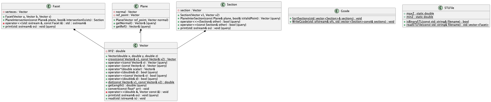

# STL_Slicer

STL_Slicer is a simple slicing program for 3D printing. It generates printable `.gcode` files from any `.stl` files.

## Usage

First, build the project using the `mingw32-make` command. The executable `.exe` file can be found in the `/bin` directory.

To run the program, execute the `./main.exe` file. The format of the parameter list is demonstrated with an example. It's recommended to copy the full path from the `/stl_testfiles` directory as a parameter to ensure the program finds the test file.

The optimal slicing thickness ranges between 0.2 and 0.35 mm. You can also try extreme cases like 1 or 0.001 mm, but in these cases, the program's runtime may significantly increase or the output file's resolution may degrade.

The program determines its progress based on an iterating variable in a "for" loop.

The program outputs a `<filename>.gcode` file, which it places in the `/stl_testfiles` directory.

## Visualization

The easiest way to visualize the output is to open it with CURA Slicer. Here's the output of `bintest.gcode`:


## How it works

First, we need to read the `.stl` file. We determine whether it's in ASCII or binary format by reading the first few bytes. Then, we create a vector of Facets, which will contain all the sides of the body as a set of 3 angles.

To slice the body, we create a Plane slicing plane, which we increase in height according to the layer thickness. In each cycle, we determine the intersection points of the sides (triangles) with the plane, which will define sections (vectors). These vectors define the path to be traversed at each level. To optimally traverse the path, we chain the vectors one after the other to form a continuous, non-jumping track.

The intersection point of the sides with the plane, its existence, is described by a simple single-variable equation system:

```((v1 + t * (v2-v1)) - p0) .dot (n) = 0```

Here's a breakdown of the formula:

v1 and v2 are vectors representing two points on the line.
t is a scalar that we're solving for. It represents how far along the line the intersection point is.
p0 is a point on the plane.
n is the normal vector of the plane.
The .dot operation represents the dot product, a fundamental operation in vector algebra.

From this point forward, we leverage the interpretation of the source code to identify the required segments and points. This is achieved through straightforward vector operations such as cross and dot products, as well as subtraction and addition operations.

UML Diagram:

